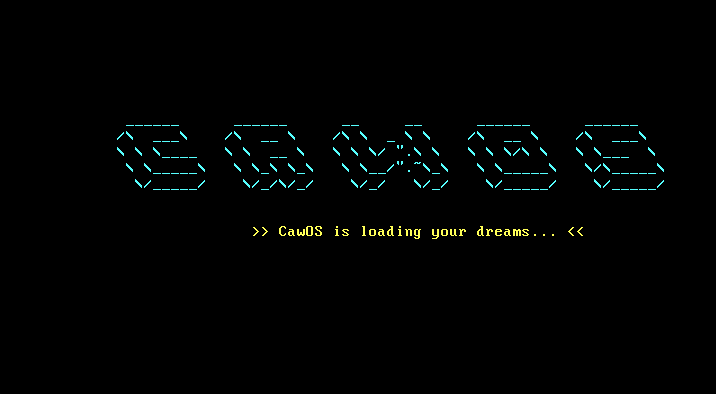
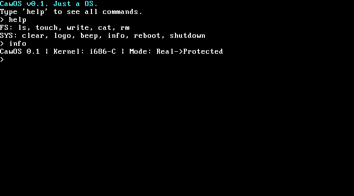

# 🐧 CawOS v0.1.5
**CawOS** — это самодельная 32-битная Unix-подобная операционная система, написанная с нуля на C и Assembly.

## ✨ Особенности
- **Custom Kernel**: Монолитное ядро в защищенном режиме.
- **RamFS**: Временная файловая система в оперативной памяти.
- **Shell**: Собственная оболочка с поддержкой команд (`ls`, `touch`, `cat`, `rm`).
- **Drivers**: VGA текстовый режим, драйвер портов I/O, PC Speaker.

## 🛠 Как собрать
Для сборки тебе понадобится кросс-компилятор `i686-elf-gcc` и `nasm`.
1. Запусти `build.bat`
2. Запусти `start.bat` (требуется QEMU)

## 📸 Скриншоты

