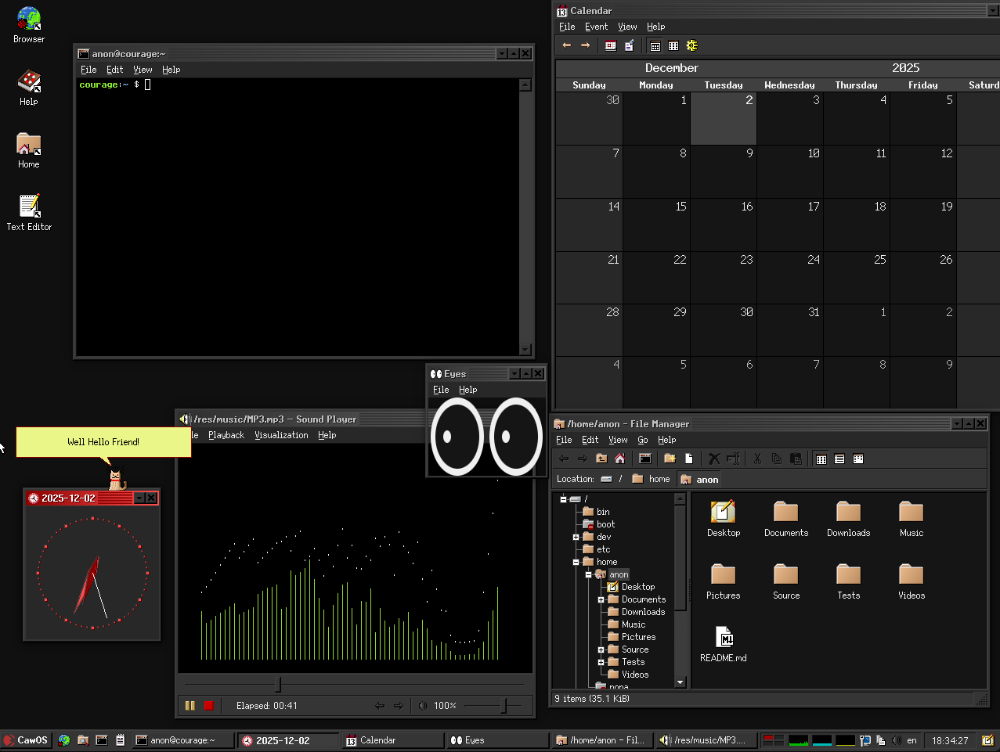

# CawOS

CawOS — настольная Unix-подобная система с собственным ядром, аккуратным интерфейсом и элементами из классики 90-х.  
Работает на x86_64, ARM и RISC-V.

## О системе

CawOS — это попытка собрать свою удобную операционку “как нам нравится”.  
Система сочетает:

- простой, аккуратный дизайн;
- классические UI-идеи;
- мощь современного Unix-ядра;
- набор встроенного софта без внешних зависимостей.

Цель — не “идеальная ОС”, а живая, понятная и открытая система, которую кайфово развивать.

## Скриншот

## Возможности

- 64-битное ядро с многопоточностью.
- Собственный рабочий стол и оконная система.
- Звук, сеть, ввод, файловые системы — всё своё.
- Браузер, редакторы, терминал, утилиты.
- IPC, сервисы (WindowServer, AudioServer и др.).
- POSIX-совместимая пользовательская среда.
- Нормальная поддержка форматoв: PNG, JPEG, WAV, FLAC, ZIP, PDF и другие.
- Поддержка тем, шрифтов и кастомизации интерфейса.
- Полноценная библиотечная экосистема (GUI, JS, аудио, графика...).
- Порты стороннего ПО через систему Ports.

И всё это находится здесь же в репозитории и собирается одним билдом.

## Документация

- Man-страницы: `man <команда>` прямо внутри системы.
- Исходники документации: `Base/usr/share/man`.
- Раздел `Documentation/` содержит информацию по коду и архитектуре.

## Сборка и запуск

Инструкция по сборке — в  
`Documentation/BuildInstructions.md`

Система собирается кросс-компилятором и запускается в QEMU с аппаратной или программной виртуализацией.

Поддерживаются Linux, macOS, Windows (через WSL2) и другие UNIX-подобные системы.

## Как участвовать

Любые улучшения, идеи и фиксы приветствуются.

Перед созданием issue загляни в:  
`CONTRIBUTING.md` → “Issue Policy”.

## Автор

- **Cawa Jones** - [CawaRUS](https://github.com/CawaRUS/)
- **Vlad** - [amnums](https://github.com/vlads1344)
- **DiddyBlud** - [tungtungsahur](https://github.com/Sleepyoun)

## Лицензия

CawOS распространяется по лицензии BSD-2-Clause.

**Основано на SerenityOS**
